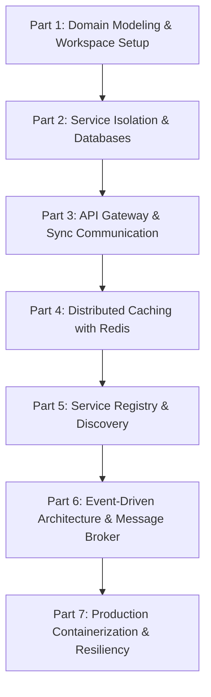
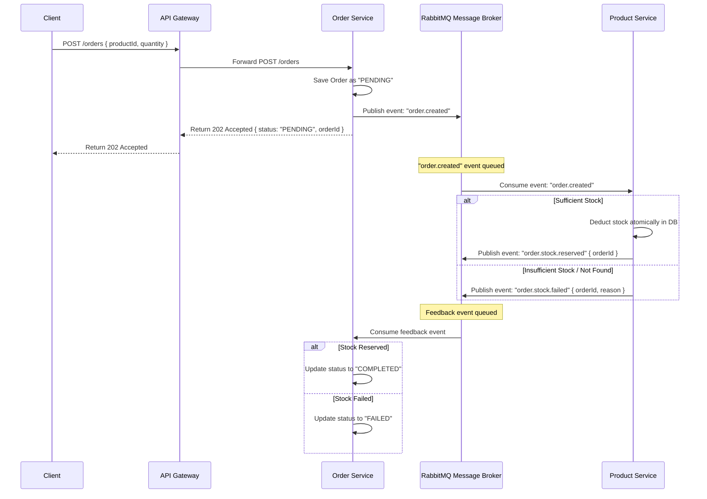

# Microservices & System Design Hands-On Learning Roadmap

We will design and build a modern, production-grade microservices system. Instead of writing code for you, this roadmap will guide you through the architectural decisions, design patterns, and system design theories, providing blueprints and assignments for you to build yourself.

To make the learning concrete, we propose building a **Mini E-Commerce Platform**. E-commerce naturally forces us to deal with service isolation, caching, distributed consistency, and asynchronous messaging.

---

## Proposed Curriculum & Steps



### Part 1: Domain Modeling, Boundaries & Workspace Setup (Current Step)
- **Concepts**: Domain-Driven Design (DDD) basics, Bounded Contexts, Microservices folder structures, and Monolith vs. Microservice trade-offs.
- **Goal**: Define the boundaries of our services, design the architecture diagram, and set up a monorepo workspace ready for Docker and Node.js.

### Part 2: Database per Service & Isolation
- **Concepts**: Database decoupling, shared database anti-patterns, polyglot persistence, and containerizing databases with Docker.
- **Goal**: Select appropriate databases for the services, configure them as independent Docker containers, and define schema isolation.

### Part 3: API Gateway & Synchronous Communication
- **Concepts**: Reverse Proxy vs. API Gateway, routing, request aggregation, authentication propagation, and synchronous HTTP vs. gRPC communication.
- **Goal**: Implement a custom API Gateway to route client requests and set up direct sync communication between services.

### Part 4: Distributed Caching with Redis
- **Concepts**: Cache-Aside pattern, Cache invalidation strategies, Cache Stampede, and Session sharing/caching in distributed systems.
- **Goal**: Connect Redis to a catalog service to speed up read operations and implement invalidation logic.

### Part 5: Service Registry & Discovery + Load Balancing
- **Concepts**: Dynamic service registry, Client-side vs. Server-side service discovery, health checks, and load balancing algorithms (Round Robin, Least Connections).
- **Goal**: Dynamically discover and load-balance requests across multiple container instances using Docker DNS or a registry tool.

### Part 6: Asynchronous Event-Driven Architecture (Event Bus / Message Broker)
- **Concepts**: Event-Driven Design, Publisher-Subscriber pattern, Redis Pub/Sub vs. Redis Streams vs. RabbitMQ, and eventual consistency.
- **Goal**: Implement order placement where the Order Service publishes an event and the Inventory and Notification Services consume it.

### Part 7: Production Containerization, Resiliency & Observability
- **Concepts**: Docker Compose multi-stage builds, circuit breakers, rate limiting, centralized logging, and tracing.
- **Goal**: Make the entire application production-ready, highly resilient, and fully observable.

---

## Choices Confirmed
- **Project Theme**: Mini E-Commerce Platform.
- **Message Broker**: RabbitMQ (for decoupling and asynchronous event communication).
- **Database**: MongoDB with Prisma ORM.

---

# Part 3: Synchronous Service-to-Service Communication (Order Service)

In this part, we implement the **Order Service** to demonstrate direct synchronous service-to-service communication via HTTP. 

```mermaid
sequenceDiagram
    participant Client as Client
    participant Gateway as API Gateway
    participant Order as Order Service (Port 3003)
    participant Product as Product Service (Port 3002)

    Client->>Gateway: POST /orders { productId, quantity } (with JWT)
    Note over Gateway: Gateway validates token & injects x-user-id
    Gateway->>Order: POST /orders
    Order->>Product: GET /products/:id (Check existence & stock)
    Product-->>Order: Return Product { price, stock }
    
    alt Sufficient Stock
        Order->>Product: PATCH /products/:id/reduce-stock { quantity }
        Product-->>Order: Confirm Stock Reduced
        Order->>Order: Save Order in order_db (MongoDB)
        Order-->>Gateway: Return Success (Order details)
        Gateway-->>Client: Return 201 Created
    else Insufficient Stock / Not Found
        Order-->>Gateway: Return 400 Bad Request
        Gateway-->>Client: Return 400 Bad Request
    }
```

## User Review Required

> [!IMPORTANT]
> The Order Service requires a direct synchronous check to the Product Service. We will need to implement:
> 1. A new `PATCH /products/:id/reduce-stock` endpoint in **Product Service** to allow stock deduction.
> 2. A brand new **Order Service** under `services/order-service/`.
> 3. An update to the **API Gateway** to forward `/orders` requests.

---

## Proposed Changes

### 1. Product Service Updates
- **File**: [product.controller.ts](file:///c:/Users/haile/OneDrive/Desktop/MY-File/NEW_SKILLS/SYSTEM-DESIGN/MICRO-SERVICE/PROJECT-1/services/product-service/src/products/product.controller.ts) & [product.services.ts](file:///c:/Users/haile/OneDrive/Desktop/MY-File/NEW_SKILLS/SYSTEM-DESIGN/MICRO-SERVICE/PROJECT-1/services/product-service/src/products/product.services.ts)
- **Change**: Add a service/controller method to reduce stock for a given product ID.
- **File**: [product.routes.ts](file:///c:/Users/haile/OneDrive/Desktop/MY-File/NEW_SKILLS/SYSTEM-DESIGN/MICRO-SERVICE/PROJECT-1/services/product-service/src/products/product.routes.ts)
- **Change**: Add `PATCH /:id/reduce-stock`.

### 2. Create Order Service
- **Location**: `services/order-service/`
- **Prisma Schema**: Set up a MongoDB model for `Order` with fields: `id`, `userId`, `productId`, `quantity`, `totalPrice`, `status`, and `createdAt`.
- **Validation Schema**: Use Zod to validate order creation (`productId`, `quantity`).
- **Synchronous Logic**: Implement `createOrder` inside `order.services.ts` that:
  - Fetches product details from `http://localhost:3002/products/:id`.
  - Performs stock check.
  - Calls `PATCH http://localhost:3002/products/:id/reduce-stock` to deduct the items.
  - Creates the order in the local `order_db` database.

### 3. API Gateway Routing
- **File**: [router.ts](file:///c:/Users/haile/OneDrive/Desktop/MY-File/NEW_SKILLS/SYSTEM-DESIGN/MICRO-SERVICE/PROJECT-1/gateway/src/router/router.ts)
- **Change**: Define `ORDER_SERVICE_URL` and map `route.use('/orders', authMiddleware, orderProxy)` so only authenticated users can place and view orders.

---

## Verification Plan

### Manual Verification
1. Create a product in `product-service` with stock = 10.
2. Place an order for quantity = 3 via the Gateway (`POST /orders`).
3. Verify that the order is successfully saved in the `order_db` database.
4. Verify that the product's stock in the `product_db` database is reduced to 7.
5. Attempt to place another order for quantity = 8, and verify it fails with an "insufficient stock" error.

---

# Part 6: Asynchronous Event-Driven Architecture (RabbitMQ Setup & Saga Choreography)

To build a resilient, loosely-coupled microservice architecture, we will transition our order placement logic from a synchronous HTTP chain to an asynchronous, message-based choreography (the Saga pattern).



## User Review Required

> [!WARNING]
> This change introduces a major architectural shift from Synchronous HTTP to Asynchronous Messaging. 
> 1. We will add **RabbitMQ** to `docker-compose.yml`.
> 2. We will install `amqplib` (the RabbitMQ client) in `order-service` and `product-service`.
> 3. Order Service endpoints will respond with `202 Accepted` (meaning the request is being processed asynchronously), rather than blocking until the stock is verified.

---

## Proposed Changes

### 1. Docker Compose Update
- **File**: [docker-compose.yml](file:///c:/Users/haile/OneDrive/Desktop/MY-File/NEW_SKILLS/SYSTEM-DESIGN/MICRO-SERVICE/PROJECT-1/docker-compose.yml)
- **Change**: Add `rabbitmq` container service with AMQP port `5672` and management interface port `15672`.

### 2. Message Broker Connection Manager
- **Component**: Auth, Product, and Order Services
- **Change**: Create a common wrapper class `src/lib/rabbitmq.ts` to manage connections, channels, and error handling.

### 3. Product Service Updates (Event Consumer)
- **Component**: Product Service
- **Change**:
  - Implement a listener that runs on startup and subscribes to the `order.created` queue.
  - Upon receiving an event, check stock. If sufficient, deduct stock and publish `order.stock.reserved`. If insufficient, publish `order.stock.failed`.

### 4. Order Service Updates (Event Publisher & Consumer)
- **Component**: Order Service
- **Change**:
  - Update `POST /orders` handler to create a new order in MongoDB with status `PENDING`, publish `order.created`, and immediately return `202 Accepted` to the client.
  - Implement a listener that runs on startup and subscribes to both `order.stock.reserved` and `order.stock.failed` queues, updating order status in the DB accordingly.

---

## Verification Plan

### Manual Verification
1. Start the RabbitMQ container and verify the management console is accessible at `http://localhost:15672`.
2. Place an order for a valid product through the Gateway.
3. Verify that the client receives an immediate `202 Accepted` response with status `PENDING`.
4. Inspect the MongoDB `Order` table to see the status transition from `PENDING` to `COMPLETED` within a split second.
5. Place an order for more items than are in stock. Verify the MongoDB `Order` status transitions from `PENDING` to `FAILED`.


